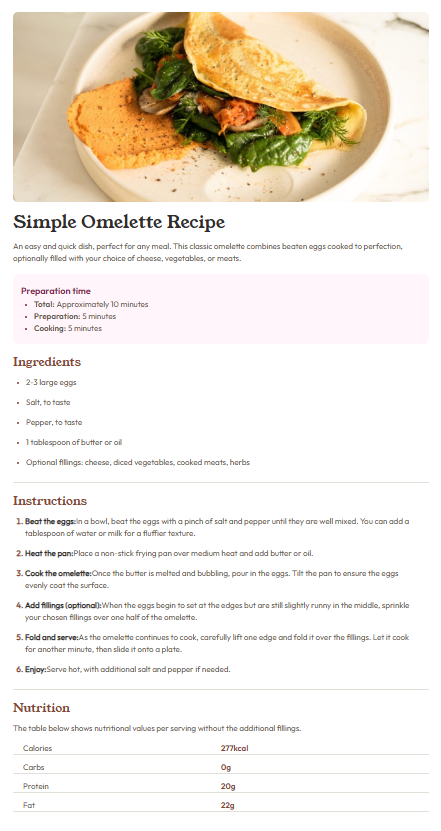

# Recipe Page

## A clean and responsive recipe layout with structured preparation data

This project implements a recipe page designed to present cooking information in a clear and organized format. The layout includes a featured recipe image, preparation time breakdown, ingredient list, step-by-step instructions, and nutritional values.

The page focuses on readability, visual hierarchy, and responsive layout, ensuring the content remains accessible and easy to follow across different screen sizes.

### Screenshots

#### Image of the Desktop Design

#### Image of the Mobile Design

### Data Structure & Scalability

Data is stractured in a reusable and scalable format, making it easy to extend the page to support additional recipes or dynamic calculations in the future.

Each preparation phase is represented as an object containing a title and time value, allowing all durations to be programmatically processed if needed (for example, calculating total time or converting units).

The preparation time data is defined as follows:

    export const prepInfo = [
      {
        title: 'Total:',
        approximate: true,
        time: {
          value: 10,
          unit: 'minutes'
        }
      },
      {
        title: 'Preparation:',
        time: {
          value: 5,
          unit: 'minutes'
        }
      },
      {
        title: 'Cooking:',
        time: {
          value: 5,
          unit: 'minutes'
        }
      },
    ] 

### Built with

- [React](https://react.dev/) - JS library
- [TypeScript](https://www.typescriptlang.org/) - type superset of JS
- [Tailwindcss](https://tailwindcss.com/) - utility-first CSS framework

## Author

- Website - [Mihailo Djurovic](portfolio-miahilo.vercel.app)

